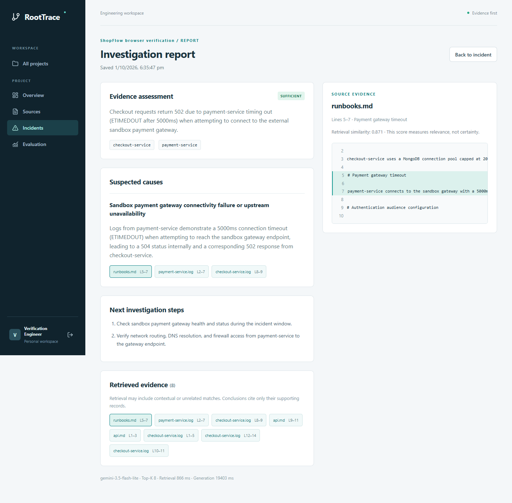

# RootTrace

An evidence-backed backend incident investigation dashboard. Upload logs and runbooks, track asynchronous indexing, describe an incident, and inspect a saved report with citations to the original source lines.



## Application

- Account registration, cookie sessions, logout, and project ownership.
- Projects, dashboard, source upload/status/retry, incidents, report history, and evaluation.
- Logs and documents retain their original line references, sections, and stack traces.
- Reports distinguish `SUFFICIENT`, `PARTIAL`, and `INSUFFICIENT` evidence.
- Project deletion removes vectors, files, and records through retryable cleanup.
- A fictional ShopFlow benchmark includes 15 cases across five failure categories.

## Stack

| Layer                   | Implementation                                          |
| ----------------------- | ------------------------------------------------------- |
| Browser                 | React, Vite, JavaScript, React Router, Axios, plain CSS |
| Business API            | Express, Mongoose, Zod, bcrypt, JWT cookies             |
| Asynchronous processing | Separate BullMQ worker and Redis TCP/TLS                |
| Analysis                | Python 3.11, FastAPI, Pydantic, Gemini adapters         |
| Evidence index          | Qdrant, 768-dimensional cosine embeddings               |
| Metadata                | MongoDB                                                 |

The browser calls Express. The worker streams uploaded file bytes to FastAPI. FastAPI handles parsing, embeddings, retrieval, report generation, and evaluation. LangChain is used only for controlled prompt formatting.

## Local setup

Install Node.js 24, Python 3.11, and Git. Run commands from the repository root.

```powershell
npm ci
py -3.11 -m venv ai-service/.venv
ai-service/.venv/Scripts/python.exe -m pip install -r ai-service/requirements-lock.txt
npm run env:setup
```

On macOS/Linux, use `python3.11 -m venv ai-service/.venv` and `ai-service/.venv/bin/python` in place of the Windows Python path.

Edit the ignored root `.env` privately. Configure:

| Variable                           | Required value                                         |
| ---------------------------------- | ------------------------------------------------------ |
| `MONGODB_URI`                      | Atlas connection string with a dedicated database name |
| `REDIS_URL`                        | Upstash **TCP** URL starting with `rediss://`          |
| `QDRANT_URL` / `QDRANT_API_KEY`    | Qdrant Cloud endpoint and key                          |
| `GEMINI_API_KEY`                   | Provider key for embeddings and investigation          |
| `JWT_SECRET` / `AI_SERVICE_SECRET` | Separate secrets generated by `env:setup`              |

Environment templates contain placeholders only. `env:setup` generates empty local secrets and preserves populated values. Credentials belong in `.env` or a deployment secret manager. Never put provider keys in `VITE_*` variables.

Default models are `gemini-3.5-flash-lite` and `gemini-embedding-2`, with 768 embedding dimensions. Model/provider selection is configured in `.env`. Changing the embedding model or dimensions requires a separate Qdrant collection and reindexing.

```powershell
npm run doctor
npm run start:local
```

Windows also supports `./scripts/start.ps1`. Open **http://localhost:5173**, register an account, and create a project. Press Ctrl+C in the launcher terminal to drain work and stop the processes. Readiness is checked with `npm run doctor -- --live`.

For separate development terminals:

```powershell
npm run dev:client
npm run dev:server
npm run dev:worker
ai-service/.venv/Scripts/python.exe -m uvicorn app.main:app --app-dir ai-service --host 127.0.0.1 --port 8000 --reload --reload-dir ai-service/app
```

Each command runs in its own terminal. The API uses port 5000; analysis uses 8000; Vite uses 5173. Use the configured `CLIENT_URL` exactly, including the hostname.

## ShopFlow walkthrough

1. Create a project called ShopFlow.
2. Upload the four files from `demo-data/logs` as application logs.
3. Upload the three files from `demo-data/docs` as documentation.
4. Wait for all seven sources to reach `READY`.
5. Create an incident such as “Checkout returns 502 while payment gateway connections time out after 5000ms.”
6. Investigate, reopen the saved report, and select a citation.
7. Open Evaluation and run Top-K 8. Report/citation checks are optional and consume additional provider quota.

The [evaluation guide](docs/evaluation.md) covers metrics and the command-line runner.

## Checks

```powershell
npm run lint
npm run build
npm test
ai-service/.venv/Scripts/python.exe -m ruff check ai-service/app ai-service/tests
ai-service/.venv/Scripts/python.exe -m pytest -c ai-service/pytest.ini ai-service/tests
npm audit
npm run scan:secrets
```

Build before running tests so the production static-serving check is exercised. Install [Gitleaks](https://github.com/gitleaks/gitleaks/releases) to run the secret scanner; on Windows it also recognizes an ignored `.tools/gitleaks.exe`.

Two optional live checks require configured managed services and all four processes:

```powershell
npm run test:queue -w server
npm run test:browser -- --cleanup
```

The browser check registers fictional accounts, uploads the dataset through the interface, investigates, opens original citations, evaluates, checks ownership and responsive layouts, and deletes its project. Screenshots and temporary session details stay under ignored `.local/browser`. Windows uses installed Edge. On Linux/macOS, run `npx playwright install chromium` first. `--reports` adds report checks to the browser evaluation.

CI runs builds, isolated Node/React/Python tests, dependency checks, and a full-history secret scan without production credentials.

## Operations

Keep Redis eviction disabled. A BullMQ worker consumes Redis commands while idle; its 30-second blocking wait reduces polling but does not eliminate command use. Stop the local launcher when finished, and monitor Upstash/provider quotas. Quota failures produce retries or explicit errors; the application does not switch to paid providers.

The API and worker share private upload storage. FastAPI receives file bytes and does not read Node filesystem paths. The current cleanup cancellation barrier requires **one FastAPI process**. See [deployment preparation](docs/deployment.md) before hosting.

## Documentation

- [Architecture and interfaces](docs/architecture.md)
- [Retrieval, evidence, and report validation](docs/rag-design.md)
- [Evaluation](docs/evaluation.md)
- [Verified behavior and limits](docs/verification.md)
- [Deployment preparation](docs/deployment.md)
- [Interview notes](docs/interview-notes.md)

Managed-service setup references: [Atlas free clusters](https://www.mongodb.com/docs/atlas/tutorial/deploy-free-tier-cluster/), [Upstash with BullMQ](https://upstash.com/docs/redis/integrations/bullmq), [Qdrant Cloud](https://qdrant.tech/pricing/), [Gemini pricing](https://ai.google.dev/gemini-api/docs/pricing), and [embedding documentation](https://ai.google.dev/gemini-api/docs/embeddings).
