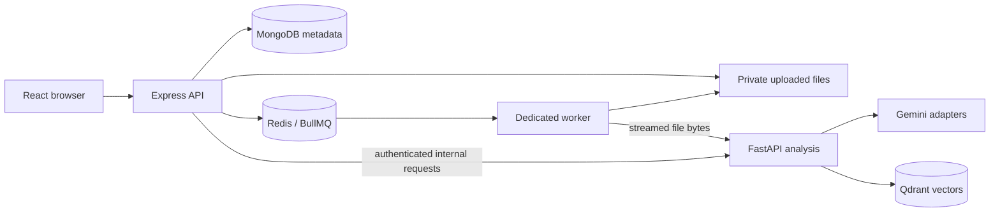

# Architecture and interfaces

## Boundaries

Express owns users, projects, source status, incidents, persisted reports, and evaluation runs. MongoDB stores this metadata and report snapshots. It does not store embeddings.

The worker performs expensive ingestion outside the upload request. Queue payloads contain source/project IDs and a private file reference; uploaded bytes are not copied into Redis. API and worker must share their upload directory.

FastAPI has no user-facing CRUD or access to the Node upload directory. Internal requests require a constant-time comparison of the shared service secret. Parsing, chunking, provider calls, vector operations, and output validation belong here.

The frontend uses local component state, a small account context, and a reusable resource hook. Active work is polled every three seconds, paused while the page is hidden, and stopped at terminal states. Plain CSS provides the desktop sidebar, responsive navigation, tables, and report/evidence panels.

## Data models

| Model         | Purpose                                                                                            |
| ------------- | -------------------------------------------------------------------------------------------------- |
| User          | Name, unique email, bcrypt hash, session revocation version                                        |
| Project       | Owner, name, description, ACTIVE/DELETING state, cleanup checkpoints                               |
| Source        | Project/owner, original filename, hidden storage reference, progress/status, attempts, chunk count |
| Incident      | Project/owner, symptoms, service, incident window, OPEN/RESOLVED state                             |
| Investigation | Incident/project/owner, lifecycle, validated report, evidence snapshot, model timings              |
| EvaluationRun | Project/owner, lifecycle, Top-K, measured case outcomes and metrics                                |

A partial unique MongoDB index permits one RUNNING investigation per incident and one RUNNING evaluation per project. Expired runs can be marked failed before a retry. These are admission constraints, not distributed locks.

## Public REST API

All project-scoped operations derive identity from the session and enforce ownership. An inaccessible resource returns 404.

| Method               | Path                                                                 | Behavior                                          |
| -------------------- | -------------------------------------------------------------------- | ------------------------------------------------- |
| POST                 | `/api/auth/register`                                                 | Register with a hashed password                   |
| POST                 | `/api/auth/login`                                                    | Set an HttpOnly session cookie                    |
| GET                  | `/api/auth/me`                                                       | Current account                                   |
| POST                 | `/api/auth/logout`                                                   | Revoke sessions and clear cookie                  |
| GET / POST           | `/api/projects`                                                      | List owned projects / create                      |
| GET / PATCH / DELETE | `/api/projects/:projectId`                                           | Read / edit / queue deletion                      |
| GET                  | `/api/projects/:projectId/dashboard`                                 | Project counts and recent work                    |
| GET / POST           | `/api/projects/:projectId/sources`                                   | List / validate and queue upload (202)            |
| GET                  | `/api/projects/:projectId/sources/:sourceId`                         | Source status                                     |
| GET                  | `/api/projects/:projectId/sources/:sourceId/lines?start=1&limit=200` | Numbered original lines, maximum 500 per response |
| POST                 | `/api/projects/:projectId/sources/:sourceId/retry`                   | Retry a failed source                             |
| GET / POST           | `/api/projects/:projectId/incidents`                                 | List / create incidents                           |
| GET / PATCH          | `/api/incidents/:incidentId`                                         | Details / resolve or reopen                       |
| GET                  | `/api/incidents/:incidentId/investigations`                          | Investigation history                             |
| POST                 | `/api/incidents/:incidentId/investigate`                             | Retrieve, generate, validate, and persist         |
| GET                  | `/api/investigations/:id`                                            | Saved report                                      |
| GET / POST           | `/api/projects/:projectId/evaluation`                                | Run history / execute dataset                     |
| GET                  | `/api/projects/:projectId/evaluation/dataset`                        | Required files and missing READY sources          |
| GET                  | `/api/projects/:projectId/evaluation/:id`                            | Full saved measurements                           |
| GET                  | `/api/health`                                                        | Liveness                                          |
| GET                  | `/api/health/ready`                                                  | MongoDB, Redis, and analysis readiness            |
| GET                  | `/api/health/config`                                                 | Safe upload configuration                         |

Mutating browser requests must have the configured origin. Production cookies are Secure; all sessions are HttpOnly and SameSite=Lax. Passwords are limited to bcrypt's 72-byte input boundary. Logout increments the account's session version, invalidating older tokens.

## Internal REST API

`X-Service-Secret` is required on ingestion, retrieval, investigation, evaluation, cleanup, and readiness.

| Method | Path                     | Input                                                                 |
| ------ | ------------------------ | --------------------------------------------------------------------- |
| POST   | `/internal/ingest`       | Multipart bytes plus project/source ID and source type                |
| POST   | `/internal/retrieve`     | Incident, project, READY source IDs, Top-K, optional metadata filters |
| POST   | `/internal/investigate`  | Incident and project evidence scope                                   |
| POST   | `/internal/evaluate`     | Project evidence scope, Top-K, optional report checks                 |
| DELETE | `/internal/projects/:id` | Cancel in-flight ingestion and delete project vectors                 |

## Ingestion and deletion

Upload validation enforces extension, actual UTF-8 text, no NUL bytes, and the configured size limit (20 MB by default). UUID storage filenames prevent user-controlled filesystem paths. Files stay outside public directories.

Source states are UPLOADED → QUEUED → PROCESSING → READY, with bounded retries leading to FAILED. Worker concurrency defaults to one, ingestion attempts to three, and exponential backoff to five seconds initially. Queue retention is bounded to 100 completed and 200 failed jobs. Restart reconciliation requeues missing work from MongoDB.

Deletion first marks the project DELETING and rejects new work. Cleanup waits for active ingestion/investigation/evaluation, removes pending source jobs, and runs checkpointed vector, file, and record removal. Each operation tolerates prior deletion. MongoDB project deletion is the final step. Workers skip projects that are absent or deleting. Uploads racing deletion remove their newly saved file and metadata rather than leaving an orphan.

Important files: `server/src/app.js`, `server/src/routes`, `server/src/workers/ingestionWorker.js`, `server/src/services/cleanup.js`, `ai-service/app/services`, and `client/src/pages`.
