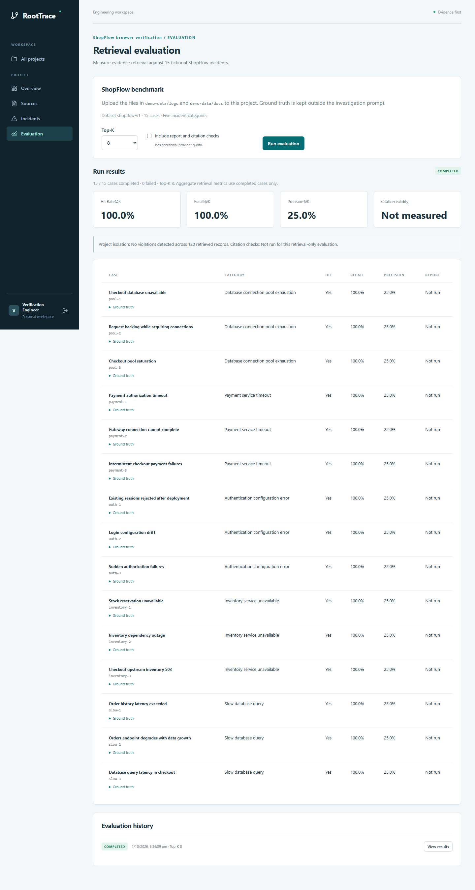

# ShopFlow evaluation

`demo-data/evaluation/cases.json` contains 15 fictional incidents: three variants for each of connection pool exhaustion, payment timeouts, authentication configuration errors, inventory unavailability, and slow queries.

Each case separates its incident symptoms, knownCause, and expectedEvidenceIds. Expected IDs are dataset aliases resolved to indexed UUIDs through a filename and original line-range anchor. UUIDs remain deterministic within a project/source; a new upload receives a new source identity, so fixed global UUIDs would be inappropriate.

Upload the unmodified files from both `demo-data/logs` and `demo-data/docs` with their original names. Evaluation requires these seven sources to be READY. It resolves expected chunks from a project-and-READY-source-filtered Qdrant scroll. Missing anchors fail explicitly rather than being treated as zero recall.

## Metrics

For each case, E is the set of expected chunk IDs and R is the retrieved set, limited to K.

| Metric            | Definition                                                                 |
| ----------------- | -------------------------------------------------------------------------- |
| Hit Rate@K        | Mean of `1` when E intersects R, otherwise `0`                             |
| Recall@K          | Mean of `intersection(E,R) / size(E)`                                      |
| Precision@K       | Mean of `intersection(E,R) / size(R)`                                      |
| Citation validity | Fraction of generated citation references that identify retrieved evidence |
| Isolation         | Number of returned records checked and project/source-scope violations     |

Metrics are macro averages over completed cases. Failed cases and completion coverage are displayed separately. An all-failed run has unmeasured metrics, not fabricated zeros or a successful status. A run with failures is PARTIAL. A retrieval-only run leaves citation validity unmeasured.

Known causes and expected IDs never enter query embedding or generation. Optional report checks reuse the evidence already retrieved for that case and validate the resulting citations and services. Invalid provider output fails the case. Accepted citation validity should be interpreted alongside completion coverage because rejected reports contribute failures rather than accepted references.

## Interface

Open Evaluation within an owned project. Select Top-K and optionally include report checks. History retains previous runs for comparison. The case table shows hit/recall/precision, sufficiency, provider failures, and an expandable ground-truth explanation.



## Command-line runner

After creating an account through the application, add `ROOTTRACE_EVAL_EMAIL` and `ROOTTRACE_EVAL_PASSWORD` privately to the ignored `.env`. These are your application account credentials, separate from managed-service credentials. Do not put a password in command arguments.

```powershell
npm run evaluate -- --project <owned-project-id> --top-k 8
npm run evaluate -- --project <owned-project-id> --top-k 8 --reports
```

The runner logs in, calls the same ownership-protected API as the interface, prints summary metrics, and saves details to ignored `.local/evaluation-latest.json`. It returns a failing exit code if any case fails. `ROOTTRACE_API_URL` can override the local API address.

## Observed benchmark

A live run on 2026-10-01 used the seven stock files, 30 indexed chunks, Top-K 8, and report checks. All 15 cases completed. Hit Rate@8 and Recall@8 were 100%, Precision@8 was 25%, and 32 accepted citation references were valid. No isolation violations appeared in 120 retrieved records.

Each case annotates a small expected set; retrieving additional context lowers this strict precision measure even when that context can be useful. This is a small fictional benchmark and does not establish production retrieval quality. Keep Top-K experiments and real incident review separate from these baseline results.
